  

  
  
  
  
  

# ⚡ Awesome In-Memory Database (Redis-Compatible) Ecosystem

> **A Curated Directory of Managed SaaS Platforms, Open-Source Redis Alternatives & In-Memory Key-Value Stores**

Welcome to the definitive, SEO-optimized awesome-list tracking high-performance **in-memory databases**, **managed Redis SaaS platforms**, **open-source forks (Valkey, KeyDB, Dragonfly)**, and **Redis-compatible key-value engines**. Whether you require sub-millisecond caching, high concurrency, active-active replication, or permissive licensing (BSD, MIT), this list provides comprehensive technical and pricing metadata.

---

## 📑 Table of Contents

- [☁️ SaaS / Hosted Platforms](#-saas--hosted-platforms)
- [🔓 Open-Source GitHub Projects](#-open-source-github-projects)
- [🛠️ Architectural Comparison & Selection Guide](#%EF%B8%8F-architectural-comparison--selection-guide)
- [🤝 How to Contribute](#-how-to-contribute)
- [💖 Support & Community](#-support--community)
- [⚖️ Disclaimer & License Notes](#%EF%B8%8F-disclaimer--license-notes)
- [📈 Star History](#-star-history)

---

## ☁️ SaaS / Hosted Platforms

💡 **Market Overview & Structure**: The global in-memory database and caching market is estimated at **$12B+ to $18B+**, exhibiting **moderate fragmentation**. While cloud hyperscalers (AWS, Azure, GCP) and Redis Inc. command significant enterprise market share, specialized serverless platforms (Upstash, Momento) and multi-threaded engines (Dragonfly, KeyDB, Aiven) capture growing market niches.

| SaaS Platform | Company & Size (Valuation / Revenue) | Starting Pricing | Free Tier / Trial Limit | Description & Key Features |
| :--- | :--- | :--- | :--- | :--- |
| **[Azure Cache for Redis](https://azure.microsoft.com/en-us/products/cache/)** | Microsoft ($3.1T Market Cap / $245B+ Rev) | ~$0.016/hour (~$11.68/mo for Basic 250MB C0) | 30-day free trial ($200 credit via Azure Free Account) | **Microsoft's managed Redis** — integrated with Azure ecosystem. *Note: Retiring by 2028; migrating to Azure Managed Redis.* |
| **[Google Cloud Memorystore](https://cloud.google.com/memorystore)** | Alphabet / Google ($2.1T Market Cap / $307B+ Rev) | ~$0.049/hour (~$36/mo for Basic 1GB) | 90-day free trial ($300 credit via GCP Free Tier) | **Google's managed Redis** — fully managed with GCP integration. Supports Valkey as a managed option. |
| **[Amazon MemoryDB for Redis](https://aws.amazon.com/memorydb/)** | Amazon / AWS ($2.0T Market Cap / $575B+ Rev) | ~$0.013/hour (~$9.50/mo for db.t4g.small) | 2-month free trial (750 hrs/mo of db.t4g.small via AWS Free Tier) | **AWS's durable in-memory database** — microsecond reads with transaction log durability. Defaults new clusters to Valkey. |
| **[KeyDB Cloud](https://keydb.dev/)** | Snap Inc. ($15.5B Market Cap / $4.6B Rev) | ~$0.018/hour (~$13/mo per node) | 14-day free trial ($300 credit on GCP/AWS Marketplace) | **Managed KeyDB** — multi-threaded Redis fork with active-active replication for high-throughput workloads. |
| **[Aiven for Redis](https://aiven.io/redis)** | Aiven ($3.0B Valuation / ~$100M ARR) | $0.026/hour (~$19/mo for Hobbyist 1GB) | 30-day free trial ($300 credit) | **Managed Redis on multiple clouds** — available on AWS, GCP, Azure, and DigitalOcean. |
| **[Redis Enterprise Cloud](https://redis.com/cloud/)** | Redis Inc. ($1.0B Valuation / ~$150M ARR) | $0.0084/GB-hour (starting at ~$5/mo) | Free forever tier up to 30 MB database RAM (1 database) | **The commercial Redis platform** — fully managed with active-active geo-distribution and commercial support. |
| **[Hazelcast Cloud](https://hazelcast.com/)** | Hazelcast ($150M Valuation / ~$30M ARR) | $0.10/GB-hour (Serverless pay-as-you-go) | Free forever tier up to 2 GB memory cluster | **In-memory data grid** — distributed caching, streaming, and compute at scale. |
| **[Upstash Redis](https://upstash.com/redis)** | Upstash ($50M Valuation / ~$5M ARR) | $0.20 per 100K requests (or $10/mo Pro tier) | Free forever tier with 10,000 requests/day & 256 MB storage | **Serverless Redis** — pay-per-request pricing with REST API and global replication for serverless apps. |
| **[Dragonfly Cloud](https://www.dragonflydb.io/)** | DragonflyDB ($30M Valuation) | $0.035/GB-hour (~$25/mo minimum) | 14-day free trial (up to 8 GB RAM instance) | **Managed Dragonfly** — multi-threaded engine delivering up to 25x throughput over single-threaded engines. |
| **[Momento Serverless Cache](https://www.gomomento.com/)** | Momento ($15M Valuation) | $0.15 per GB data transferred | Free forever tier up to 50 GB data transfer per month | **Serverless caching platform** — instant provisioning with sub-millisecond latency for serverless architectures. |

---

## 🔓 Open-Source GitHub Projects

*Sorted by GitHub Star Count (Descending)*

1. **[Redis](https://github.com/redis/redis)**   
   **The original in-memory data structure store**, now licensed under AGPLv3 / RSALv2 / SSPLv1 . Features built-in data types (strings, hashes, lists, sets, sorted sets, streams), transactions, pub/sub, Lua scripting, and persistence options (RDB/AOF).

2. **[Dragonfly](https://github.com/dragonflydb/dragonfly)**   
   **Modern ultra-fast in-memory data store**, BSL 1.1 licensed. Built with a shared-nothing multi-threaded architecture yielding up to 25x throughput over single-threaded Redis engines while consuming 15–22% less RAM per key.

3. **[Valkey](https://github.com/valkey-io/valkey)**   
   **The primary community-driven open-source fork of Redis**, BSD-3-Clause licensed under the Linux Foundation. Supported by AWS, Google, and Oracle, Valkey preserves 100% RESP compatibility with enhanced multi-threaded I/O (up to 1.19M QPS).

4. **[TiKV](https://github.com/tikv/tikv)**   
   **CNCF Cloud-Native Distributed Transactional Key-Value Store**, Apache-2.0 licensed. Written in Rust, providing ACID transactions, Raft consensus replication, and horizontal scalability for massive workloads.

5. **[Memcached](https://github.com/memcached/memcached)**   
   **The classic high-performance, distributed memory object caching system**, BSD-3-Clause licensed. Simple key-value caching model designed for dynamic web applications to alleviate database load.

6. **[KeyDB](https://github.com/Snapchat/KeyDB)**   
   **High-performance multi-threaded Redis fork from Snapchat**, BSD-3-Clause licensed. Supports multi-threaded query execution, active-active multi-master replication, and FLASH storage extension for cold datasets.

7. **[Garnet](https://github.com/microsoft/garnet)**   
   **Microsoft Research's remote cache store**, MIT licensed. Built on .NET with lock-free data structures, async I/O, and low garbage collection overhead, offering high throughput and ~70% Redis API compatibility.

8. **[DiceDB](https://github.com/DiceDB/dice)**   
   **In-memory real-time database with SQL reactivity**, BSD-3-Clause licensed. A drop-in replacement for Redis with transparent cache spill-to-disk capabilities using RocksDB.

9. **[Ristretto](https://github.com/dgraph-io/ristretto)**   
   **High-performance, memory-bound Go cache**, Apache-2.0 licensed. Focuses on high hit ratios, tiny-LFU admission control, and low contention under massive concurrent access.

10. **[Hazelcast Open Source](https://github.com/hazelcast/hazelcast)**   
    **Distributed in-memory data grid**, Apache-2.0 licensed. Offers distributed data structures (IMap, Queue), event streaming, and in-memory compute for enterprise Java workloads.

11. **[Apache Kvrocks](https://github.com/apache/kvrocks)**   
    **Distributed key-value database on top of RocksDB**, Apache-2.0 licensed. Fully compatible with Redis protocol, designed to store terabytes of data at dramatically lower memory costs.

12. **[BuntDB](https://github.com/tidwall/buntdb)**   
    **Embeddable in-memory key/value database for Go**, MIT licensed. Supports spatial indexing (R-Tree), custom indexing, transactions, and JSON path querying.

13. **[LedisDB](https://github.com/siddontang/ledisdb)**   
    **High-performance Redis-like database written in Go**, MIT licensed. Uses LevelDB or RocksDB as backend storage to bypass RAM size limits.

14. **[SugarDB](https://github.com/EchoVault/SugarDB)**   
    **Embeddable and distributed in-memory alternative to Redis**, Apache-2.0 licensed. Written in Go with LFU/LRU eviction, pub/sub, Raft clustering, and modular persistence engines.

15. **[tinyredis](https://github.com/HSn0918/tinyredis)**   
    **Lightweight Redis-compatible cache server in Go**, Open-source. Features Raft-based clustering, auto-failover, and core RESP command support.

---

## 🛠️ Architectural Comparison & Selection Guide

- 🛡️ **For 100% Permissive Open-Source Licensing**: Choose **[Valkey](https://github.com/valkey-io/valkey)** (BSD-3-Clause) — the Linux Foundation standard backed by AWS, GCP, and Oracle.
- 🚀 **For Maximum Vertical Scale & Throughput**: Deploy **[Dragonfly](https://github.com/dragonflydb/dragonfly)** (BSL 1.1) to leverage modern multi-core CPUs and reduced RAM footprints.
- 🔄 **For Active-Active Multi-Master Replication**: Select **[KeyDB](https://github.com/Snapchat/KeyDB)** for multi-threaded multi-region active-active clusters.
- 💻 **For .NET High-Performance Services**: Utilize **[Garnet](https://github.com/microsoft/garnet)** (MIT) from Microsoft Research.
- 💾 **For Terabyte-Scale Disk-Spill Key-Value Storage**: Implement **[Apache Kvrocks](https://github.com/apache/kvrocks)** or **[DiceDB](https://github.com/DiceDB/dice)**.

---

## 🤝 How to Contribute

Contributions are welcome! Follow these steps to submit additions or updates:

1. 🔀 **Fork** this repository.
2. 📝 **Add/Update entries** in `README.md` following the standardized table or list format.
3. 📌 **Ensure accuracy**: Verify license types, star counts, pricing tiers, and GitHub links.
4. 🚀 **Submit a Pull Request** with a concise summary of changes.

---

## 💖 Support & Community

Thank you for exploring this curated guide to in-memory databases! If you found this repository helpful, please consider supporting the project:

- ⭐ **Star this repository** to help others discover it.
- 🔀 **Fork and contribute** updates or new Redis-compatible databases.
- 📢 **Share** with your fellow platform engineers, developers, and DevOps teams.
- ☕ **Sponsor / Buy me a coffee**: Support ongoing open-source maintenance via the [GitHub Sponsor Dashboard](https://github.com/sponsors/ishandutta2007).

---

## ⚖️ Disclaimer & License Notes

- **Community Curated**: This list is compiled for informational purposes.
- **Security & Compliance**: In-memory databases store active application data. Implement network isolation, TLS encryption, authentication, and RBAC in production.
- **License Considerations**: Verify licenses before deployment (BSD-3-Clause for Valkey/KeyDB/Memcached, MIT for Garnet/BuntDB/LedisDB, BSL 1.1 for Dragonfly, AGPLv3/SSPL for Redis 8).

---

## 📈 Star History

---

  <b>Maintained by <a href="https://github.com/ishandutta2007">Ishan Dutta</a> • Also see <a href="https://github.com/ishandutta2007/Awesome-Awesome-Awesome">Awesome-Awesome-Awesome</a></b>

